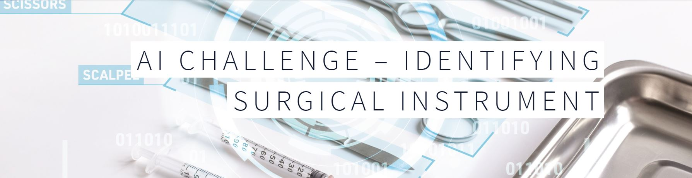

# HA_challenge_AI_imageRecognition
Open Contest of image recognition on surgical instruments held by Hong Kong Health Authority

 
Computer vision has advanced considerably but is still challenged in matching the precision of human intelligence. Could AI assist humans to perform surgical instrument counting go in and out of Hospital Operating Theatre - a task that takes place over a hundred thousand times per year!

In this competition, you are challenged to build a machine learning model that identifies the categories of Ophthalmology surgical instrument in an image dataset on HKSTP’s latest service addition – Validation Platform where Optimal Performance Metrics can be formed. By automating the task, your participation will help spare enormous amount of health professional time for direct patient care and connection.

Registration Deadline: 30 Sep 2020
 
Contestant Briefing: 6 Oct 2020
 
Model Training: Sep to Nov 2020
